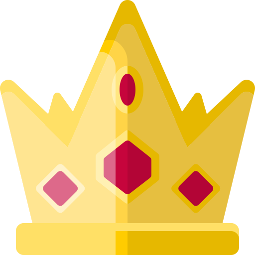
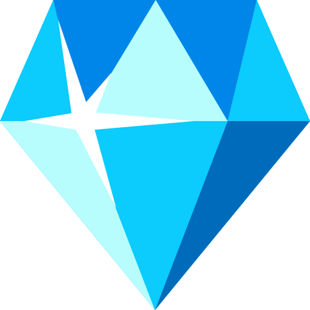
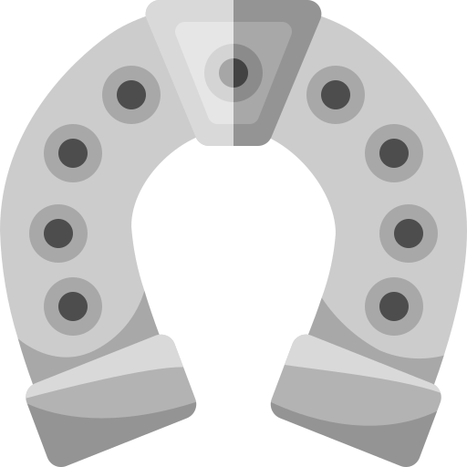

  

<h1 align="center">
  Slot Sauce by: Michael Saucedo
</h1>

From my own imagination, a carousel I converted into a responsive slot machine. I thought of this slot machine type of project from lessons by David DeSandro: Intro to CSS 3D transforms. The lesson was from 2015 using HTML, CSS and JavaScript. This project is in React with ESLint, Prettier code formatter, Tailwind CSS, and vanilla CSS for the 3D transform methods. I got to dive into the useRef and useLayout React hooks, as well as the prop-types package.

You can adjust the slider on top to select the amount of symbols per reel that you desire and use the SPIN button at the bottom. [Visit Site](https://slotsauce.netlify.app/)

## 🧐 What's inside?

A quick look at the symbols you'll see in this React slot machine project.

&nbsp;
&nbsp;
&nbsp;
&nbsp;
&nbsp;
&nbsp;
&nbsp;

Icons created by IconsNova - Flaticon
